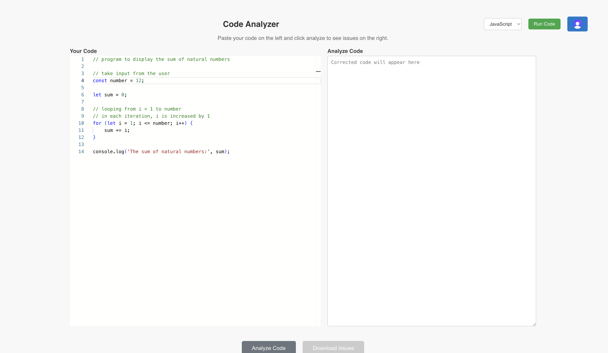
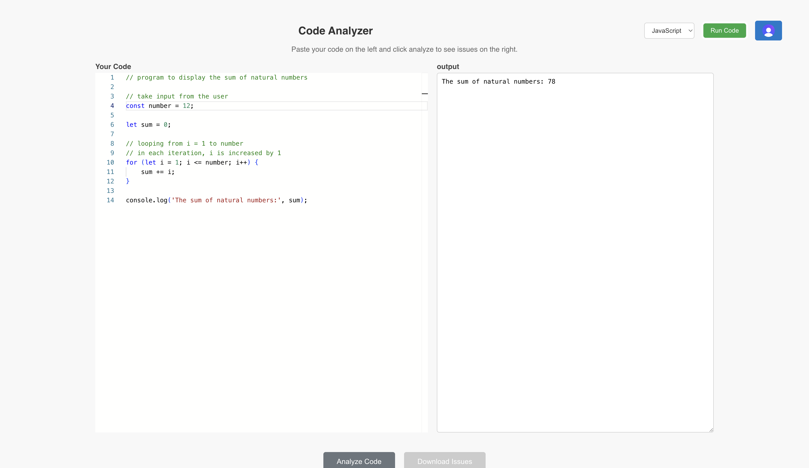
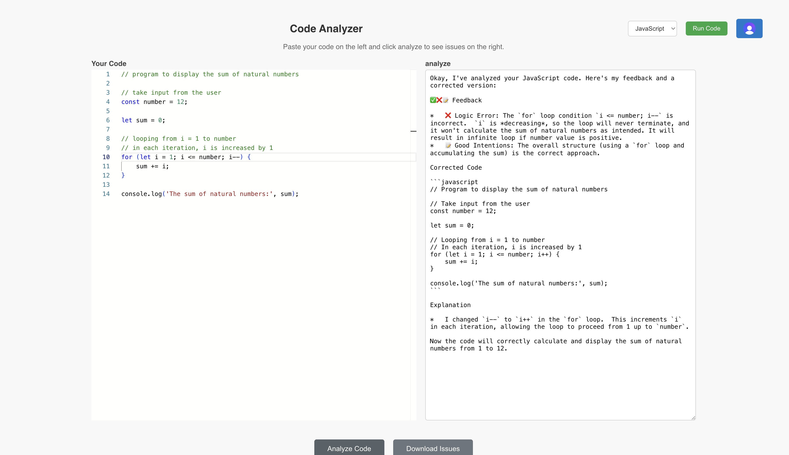

<h1>AI powered code optimization</h1>
<h2>Interface will look like this:</h2>

<h2>If you click on the run code!</h2>

<h2>If your code contains some logical error then this appears:</h2>

<h2>If you click on the Analyze code that gives you the detailed explaination + correct code</h2>

<h2>If you click on the download issues</h2>

In order to run this project
please generate your api key of the clerk for the authetication and for the code analyze part use the googlegenai npm package and also genrate api key for this also.

